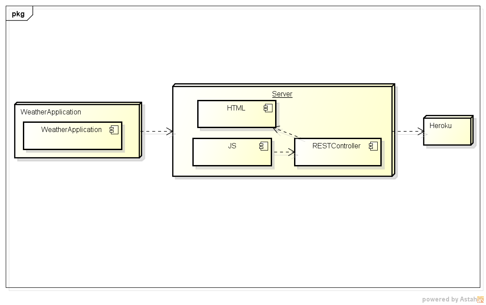
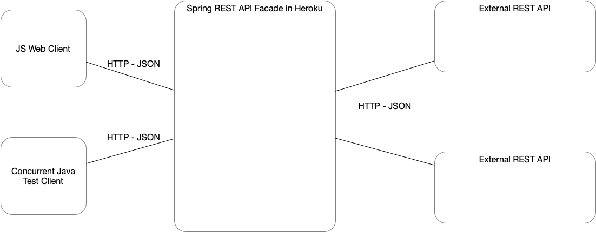

# microservices-weather

## Diseño

- Extensible
Implementa interfaces para poder hacer distintas consultas si se requieren
- Usa patrones
Altamente coherente, bajo acoplamiento
- Modular
Esta separado en paquetes

---

## Cómo se puede extender
Mediante la agregacion de metodos en las interfaces y en la implementacion de los Stub se cambia unicamente la URL solicitada ya que el GET(recurso) es el mismo.

---

## Cómo podría hacer que una función específica la implementara un proveedor de servicios diferentes.
Simplemente cambiando el campo de URL para el API que se quiera utilizar de tal forma que obtiene los datos desde alli y el controlador responde con el recurso que encuentre.

---